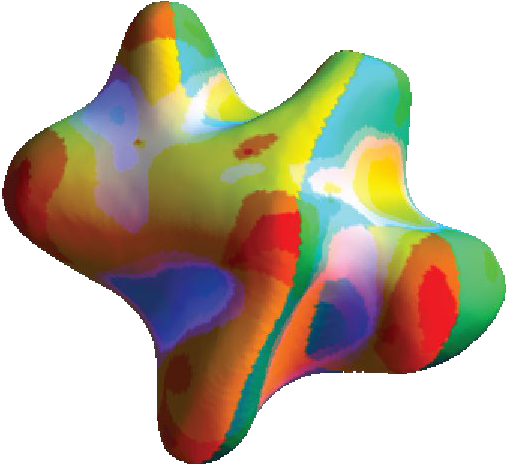

# Monitor Utilities



A set of Mathematica utilities for calculating monitor size characteristics for vision experiments.

Requires an association to describe the monitor ---
```
 <|"xres"-> ,"yres"-> ,"xsize"-> ,"ysize"->, "distance"->, "name"-> |>
```

Resolution in pixels, distances and sizes in cm.

Copyright © 1997-2017 Flip Phillips & Skidmore Vision Lab

MIT License
